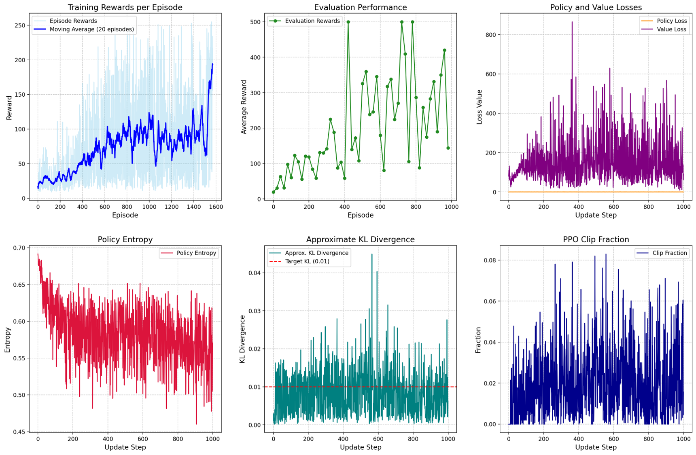
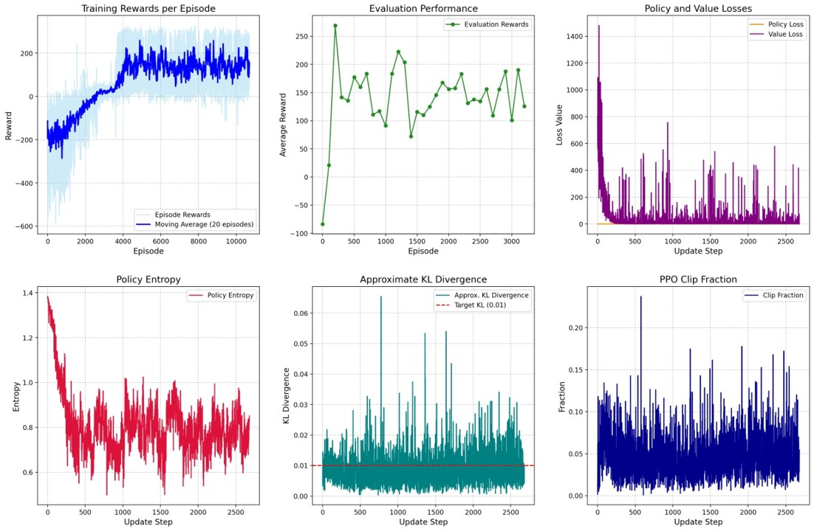

#  PPO Agent for LunarLander-v3 and CartPole-v1

This project implements **Proximal Policy Optimization (PPO)** using PyTorch and Gymnasium to train an agent to solve the `LunarLander-v3` environment.

Features:
- Actor-Critic architecture with shared layers
- Generalized Advantage Estimation (GAE)
- PPO clipped objective
- Evaluation, plotting, and MP4 video recording of performance
- Automatic saving of best and final models

---

##  Algorithm Summary

PPO is a policy gradient method that balances performance improvement and stability by using a clipped surrogate objective to limit drastic updates.

> This implementation uses:
> - Shared base network
> - Advantage normalization
> - Early stopping with KL divergence
> - Entropy bonus
> - Evaluation every N episodes with video + plot output

---

##  Installation

Clone this repo and install dependencies:

```bash
git clone https://github.com/your-username/ppo-lunarlander.git
cd ppo-lunarlander
pip install -r requirements.txt
```

> You may need to install `ffmpeg` if you want to save videos:
> ```bash
> sudo apt install ffmpeg
> ```

---

##  Training

Run the training loop:

```bash
python main.py
```

During training:
- Checkpoints saved to `model/`
- Videos saved to `mp4_files/`
- Training plots saved to `plots/`

---

##  Example Output

**Training reward trend:**
reward plots and learning curves of cart pole

reward plots and learning curves of luna lander

**Evaluation video sample:**

> (Save as `eval_final.mp4` in `mp4_files/`)

---

##  Configurable Hyperparameters

All main hyperparameters are defined at the top of the script:

```python
GAMMA = 0.99
LAMBDA = 0.97
EPS_CLIP = 0.2
LR_ACTOR = 3e-4
LR_CRITIC = 3e-4
ENT_COEF = 0.01
VF_COEF = 0.5
TARGET_KL = 0.01
```

You can tune these for other environments or experimentation.

---

##  Evaluation

You can run evaluation separately:

```python
from main import PPOAgent, evaluate_agent

agent = PPOAgent(state_dim, action_dim)
agent.load_model("model/ppo_model_best.pth")
evaluate_agent(agent, "LunarLander-v3", num_episodes=10)
```

---

##  Project Structure

```
main.py                  # Full PPO implementation + training loop
model/                   # Saved PyTorch models
mp4_files/               # Recorded evaluation videos
plots/                   # Training plots (reward, losses, entropy, etc.)
requirements.txt         # Dependencies list
```

---

##  Credits

This implementation is inspired by the paper Proximal Policy Optimization Algorithms
[link to paper](https://arxiv.org/pdf/1707.06347)
---
